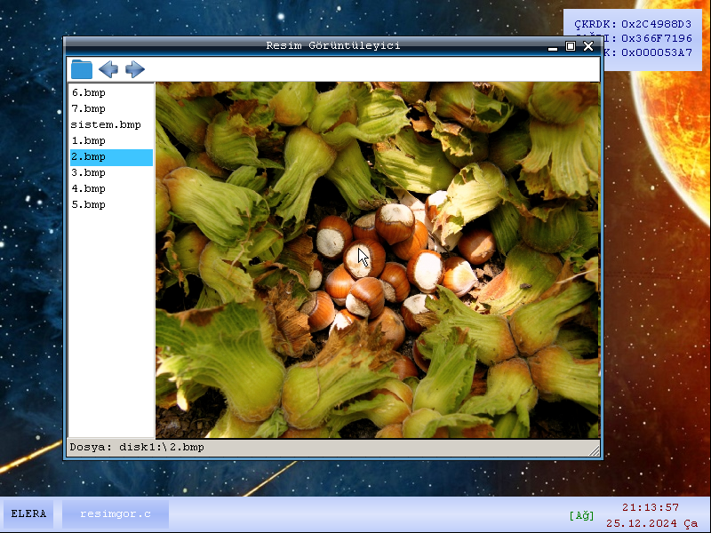
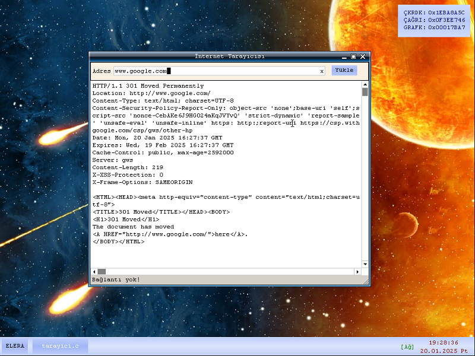
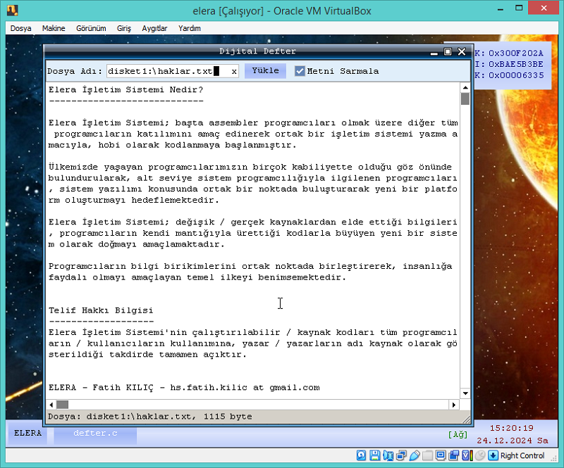
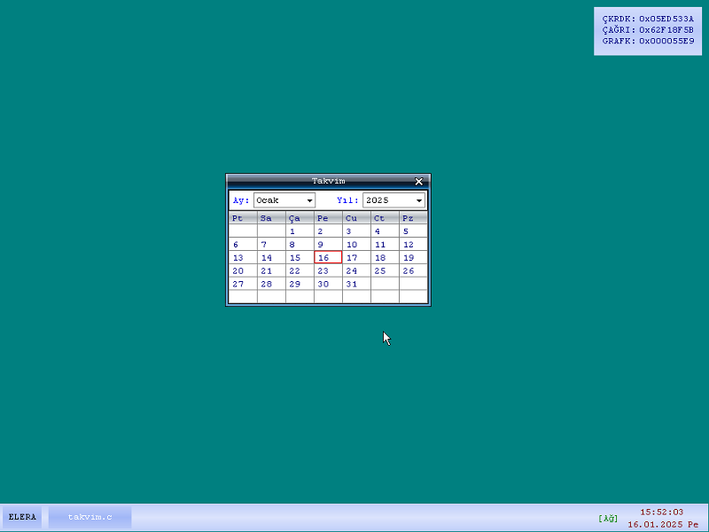

ELERA İşletim Sistemi (elerais) - 0.3.6 [R32]

---
Kullanılan Yazılım Araçları:

* Windows 7 Professional - 64 / 32 bit
* Lazarus 2.0.8 - FPC 3.0.4
* ImDisk
* Virtualbox 7.0.20

---

---
Öğretici Videolar

* [Öğretici 1 - Kaynak Kodların Depodan Alınması](https://www.youtube.com/watch?v=Zns4jp_sYag&t=6s)
* [Öğretici 2 - Sistemin Sanal Makinede (VMware) Çalıştırılması](https://www.youtube.com/watch?v=qxFRP9_-SAU&t=8s)
* [Öğretici 3 - Derleme Öncesi Lazarus'un Kurulumu](https://www.youtube.com/watch?v=pbPb-zUBGcc)
* [Öğretici 4 - Grafiksel Çekirdeğin Derlenmesi](https://www.youtube.com/watch?v=bfxTdG4b25U)
* [Öğretici 5 - ELERA İşletim Sistemi için Program Geliştirme](https://www.youtube.com/watch?v=13oYpeXDYbQ)

---
Türkçe - Elera İşletim Sistemi Nedir?

* Elera İşletim Sistemi; başta assembler programcıları olmak üzere diğer tüm programcıların katılımını amaç edinerek ortak bir işletim sistemi yazma amacıyla, hobi olarak kodlanmaya başlanmıştır.

* Ülkemizde yaşayan programcılarımızın birçok kabiliyette olduğu göz önünde bulundurularak, alt seviye sistem programcılığıyla ilgilenen programcıları, sistem yazılımı konusunda ortak bir noktada buluşturarak yeni bir platform oluşturmayı hedeflemektedir.

* Elera İşletim Sistemi; değişik / gerçek kaynaklardan elde ettiği bilgileri, programcıların kendi mantığıyla ürettiği kodlarla büyüyen yeni bir sistem olarak doğmayı amaçlamaktadır.

* Programcıların bilgi birikimlerini ortak noktada birleştirerek, insanlığa faydalı olmayı amaçlayan temel ilkeyi benimsemektedir.

English - What is Elera Operating System?

* Elera Operating System; Aiming to involve all other programmers, especially assembler programmers, it started to be coded as a hobby in order to write a common operating system.

* Considering that our programmers living in our country have many capabilities, it aims to create a new platform by bringing together programmers who are interested in low level system programming at a common point about system software.

* Elera Operating System; It aims to be born as a new system that grows with the codes that the programmers produce with their own logic.

* By combining the knowledge of programmers in a common point, it adopts the basic principle that aims to be beneficial to humanity.

---

Türkçe - Telif Hakkı Bilgisi

* Elera İşletim Sistemi'nin çalıştırılabilir / kaynak kodları tüm programcıların / kullanıcıların kullanımına, yazar / yazarların adı kaynak olarak gösterildiği takdirde tamamen açıktır.

English - Copyright Information

* The executable / source codes of Elera Operating System are completely open to all programmers / users if the author / authors name is shown as a source.

---

ELERA - Fatih KILIÇ - hs.fatih.kilic at gmail.com